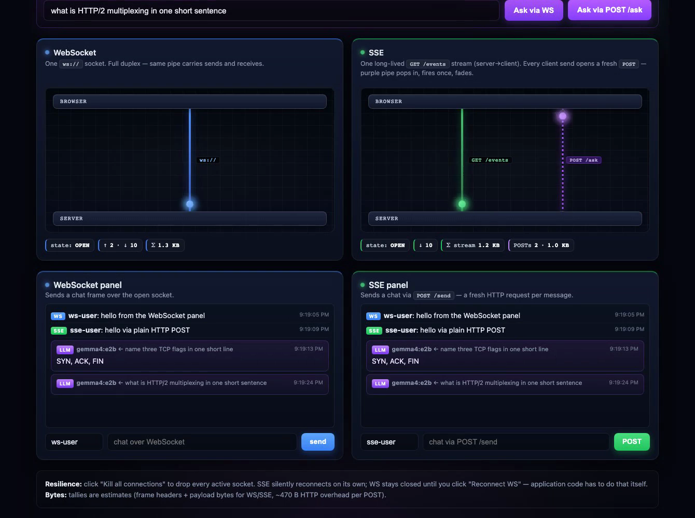

# WebSocket vs SSE — visualized demo

Small TypeScript app that runs both transports against the same server and animates every network event so the difference between them is visible in real time.

[](recordings/ws-vs-sse-demo.mp4)

▶ **[Watch the 44-second demo recording](recordings/ws-vs-sse-demo.mp4)** — chat over both transports, LLM streaming fanned out to both, kill all connections, watch SSE auto-reconnect and WS need a manual reconnect.

## What it shows

Two lanes side by side:

- **WebSocket** — one persistent `ws://` socket. Sends and receives ride the same blue pipe; packets travel both ways.
- **SSE** — one persistent `GET /events` stream (green pipe, server → client only). Every client-to-server message opens a fresh `POST` — a dashed purple pipe pops in, fires once, fades out.

Per-lane counters track frames in/out, events received, POSTs sent, and an estimated bytes-on-wire total (WS framing + payload for the socket; SSE event framing + ~470 B HTTP overhead per POST).

A control bar drops every active connection on the server side. After the kill: SSE's `EventSource` reconnects on its own, but the WebSocket stays dead until the page clicks **Reconnect WS** — the protocol gives WS no automatic recovery; the application has to do it.

An "Ask the LLM" prompt at the top streams a model response. The server consumes the model's stream once and broadcasts each token chunk to both transports, so identical token-by-token output renders on both lanes simultaneously.

## Run it

Requires Node 20+.

```bash
npm install
npm run build
npm start
```

Open <http://localhost:3300>.

### LLM backend

The server reads three env vars:

| var | default |
| --- | --- |
| `LLM_BASE_URL` | `http://localhost:11434/v1` (Ollama) |
| `LLM_MODEL`    | `gemma4:e2b` |
| `LLM_API_KEY`  | _empty_ — set when the endpoint requires auth |

The endpoint must be OpenAI-compatible (`POST /chat/completions` with `stream: true`). Two common setups:

**Local Ollama**
```bash
ollama pull gemma4:e2b   # or any model you prefer
npm start
```

**OpenRouter (or any hosted OpenAI-compatible API)**
```bash
LLM_BASE_URL='https://openrouter.ai/api/v1' \
LLM_API_KEY='sk-or-…' \
LLM_MODEL='nvidia/nemotron-3-nano-30b-a3b:free' \
npm start
```

## Re-record the demo video

```bash
npx playwright install chromium     # one-time
node scripts/record.mjs             # writes recordings/ws-vs-sse-demo.webm
```

The script drives a clean browser through every interaction (WS chat, SSE chat, ask via WS, ask via POST, kill, reconnect, follow-up chat). Convert to mp4 with `ffmpeg`:

```bash
ffmpeg -i recordings/ws-vs-sse-demo.webm -c:v libx264 -crf 22 -pix_fmt yuv420p recordings/ws-vs-sse-demo.mp4
```

## Layout

```
src/server.ts           # http server + ws upgrade + sse + POST /send + POST /ask + POST /kill
public/index.html       # the visualization (single-file)
scripts/record.mjs      # Playwright choreography that produces the demo video
```
